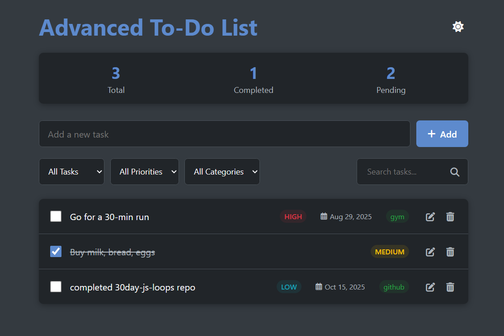

# Advanced To-Do List App

An advanced and modern To-Do List application with a responsive UI.  
This app helps you manage tasks with categories, priorities, filters, themes, and drag-and-drop functionality.  
All data is stored locally using the browser's LocalStorage.

---

## Features
- **Task Management**
  - Full CRUD operations (Create, Read, Update, Delete)
  - Assign due dates to tasks
- **Filtering System**
  - Multiple filter options available:
 1. By Category
  2. By Status (Pending, Completed, All)
  3. By Priority
  - Each filter can be applied as a single filter or combined with others for multi-filtering
  - Search tasks by text
- **UI and User Experience**
  - Modern and minimal user interface
  - Responsive design (works on mobile and desktop)
  - Drag & Drop support for rearranging tasks
  - Light and Dark theme support
- **Statistics**
  - Total number of tasks
  - Number of completed tasks
  - Number of pending tasks
- **Data Persistence**
  - Tasks are stored in browser LocalStorage

---

## Live Demo
[Live Demo](https://erfan-web.github.io/advanced-todo-list-app/)

---

## Preview
  

---

## Installation & Run
```bash
# Clone the repository
git clone https://github.com/erfan-web/advanced-todo-list-app.git

# Navigate into the project folder
cd advanced-todo-list-app

# Run the app
# Simply open index.html in your browser
```

## License
This project is licensed under the MIT License. See the LICENSE file for details.


